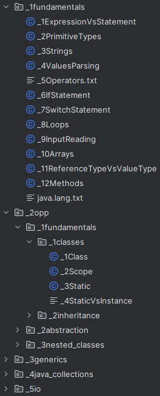

# Java in Nutshell

 

Code examples containing maximum content with as concise presentation as possible for people who want to start their adventure with Java programming.

## Installation

Project is not intended to be installed, just download it and browse it in your favorite IDE.

```bash
git clone https://github.com/jakub-galazka/java-in-nutshell.git
```

## Usage

The structure of the project has been numbered so that the increase in package numbers determines the path of learning.



Enjoy your studies! 😉

## References

The presented code snippets were created as notes during my mastery of Java and are mainly based on the [Java Programming Masterclass](https://www.udemy.com/course/java-the-complete-java-developer-course/) course prepared by [Tim Buchalka](https://www.udemy.com/user/timbuchalka), which I highly encourage you to take.

### Other references

* [Java Documentation](https://docs.oracle.com/en/java/)

* [Javatpoint: Java Tutorial](https://www.javatpoint.com/java-tutorial)
